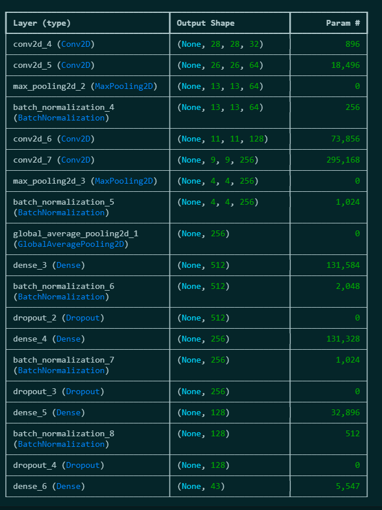
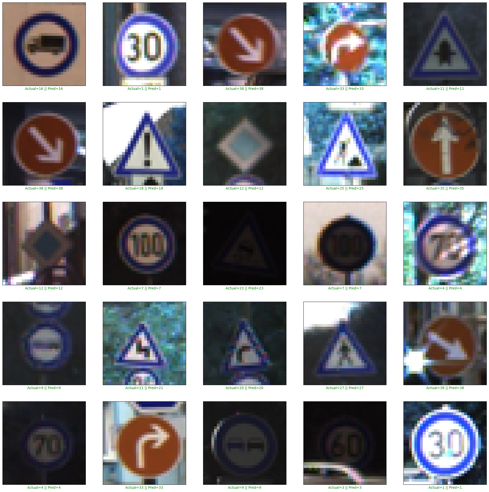

# Traffic Sign Recognition using Convolutional Neural Networks (CNN)

## Project Overview
This project focuses on the development of a machine learning program for **Traffic Sign Recognition** using Convolutional Neural Networks (CNN). 
The system is designed to provide a foundation for automated road transportation by identifying traffic signs under various environmental conditions

## Data Analysis
The model is trained on the **German Traffic Sign Recognition Benchmark (GTSRB)** 

**Dataset Size**: Over 50,000 images in total.
**Class Distribution**: 43 distinct classes of traffic signs.
**Training/Testing Split**: Approximately 39,000 images for training and 12,000 for testing.
**Handling Imbalance**: The original dataset was imbalanced, leading to potential misclassification of under-sampled signs like "keep right" or "go straight" 
**Oversampling Strategy**: Underrepresented classes were oversampled to match the class with the highest number of images, creating a balanced dataset for training.

## Model Architecture
The approach uses a deep CNN architecture to capture complex image features through multiple layers.

### Layer Specifications:
1.  **Input Layer**: $30 \times 30 \times 3$ RGB images.
2. **Convolutional Layers**: Four layers using 32, 64, 128, and 256 filters respectively ($3 \times 3$ size) with **ReLU** activation.
3. **Pooling Layers**: Two Max-Pooling layers ($2 \times 2$) to reduce computational power while retaining important features.
4. **Global Average Pooling**: Used to convert 2D features into a 1D vector to reduce parameters and prevent overfitting.
5. **Fully Connected (Dense) Layers**: Three dense layers (512, 256, and 128 neurons) to build complex representations.
6. **Regularization**: Integrated **Batch Normalization** and **Dropout** (ranging from 30% to 50%) to ensure stable training and prevent memorization.
7. **Output Layer**: 43 neurons with **Softmax** activation to predict class probabilities.

## Training & Performance
The model was optimized using the **Adam optimizer** and **Categorical Crossentropy** loss

* **Early Stopping**: Implemented to halt training when validation loss stopped improving.
* **Learning Rate Scheduler**: Used `ReduceLROnPlateau` to decrease the learning rate ($0.001$ base) when the model reached a performance plateau.
* **Final Results**:
    * **Test Accuracy**: 98.749% 
    * **Precision Score**: 0.980 
    * **Recall Score**: 0.979
 

## Challenges & Limitations
Despite high performance, approximately 1.3% of signs remain undetected due to extreme conditions
**Distortions**: Signs covered by shadows or tree branches
**Environmental Factors**: Sun gleam or weather conditions making signs unrecognizable to the naked eye
